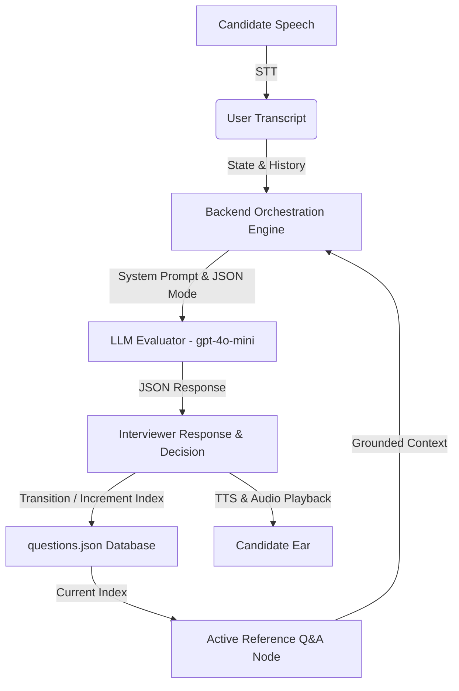

# AegisVoice Architecture Note: Grounded Voice Mock Interview Practice Agent

AegisVoice is a real-time, voice-based interview practice agent designed to screen software engineering candidates. The core system architecture prioritizes consistent grading criteria by grounding the interviewer LLM in a structured reference Q&A set, while using modern browser APIs and managed cloud endpoints to deliver a natural, conversational interview flow.

---

## 1. Grounding & Retrieval Design

The primary risk of open-ended interview agents is "hallucinating" correct answers or letting the candidate drift off-topic. AegisVoice ensures consistency through a grounded grounding pipeline.



### Storage and Chunking
The reference Q&A database is stored as a structured JSON file at `backend/data/questions.json`.
- **Chunking Strategy**: Since each interview question represents a distinct topic (e.g., *React State Management*, *Database Indexing*), chunking is performed at the **Document Level** (one complete question object per topic). There is no sub-document text chunking, as each question and its evaluation criteria must be read as a single, coherent semantic unit by the evaluator.
- **Updatability**: Storing the questions in JSON makes it trivial to edit them. The interface includes a full-fledged **Q&A Reference Manager** that allows users to perform CRUD operations on these questions in the browser, writing directly back to `questions.json` in real time.

### Grounding & Index Matching
A common error in interview agents is relying solely on semantic vector search (e.g., embeddings) to match questions. In a conversational setting, if a candidate rambles or references a different technology, vector search might retrieve a completely wrong question, causing the agent to ask questions out of order or lose track.
- **State-Machine Matching (Hybrid Approach)**: AegisVoice tracks the interview progress using a state-machine that maintains a `currentQuestionIndex`.
- **Flow**:
  1. The backend retrieves the specific Q&A node matching `currentQuestionIndex`.
  2. The LLM is prompted with *only* this active reference question and its ideal answer schema.
  3. The LLM evaluates the candidate's response against this specific grounding node.
  4. If the candidate answers correctly or the discussion on the topic is exhausted, the LLM sets the `decision` field to `"transition"`. The backend state-machine intercepts this, increments `currentQuestionIndex`, and loads the next grounding node.
- **Why this approach?** It guarantees a coherent, structured progression through the interview topics, preventing the LLM from getting derailed or skipping questions, while still allowing the LLM full flexibility to ask natural, context-specific follow-ups before moving on.

---

## 2. Interviewer Behavior, Guardrails, and Mentorship

To make the agent behave like a real human interviewer, the system uses a dual-evaluation prompt with structured JSON formatting.

### Promoting Follow-Ups & Preventing Answer Leaks
The system prompt contains strict behavioral guardrails:
1. **Never Leak the Ideal Answer**: The LLM is instructed not to output the reference text or use its exact phrasing. Instead, it must analyze the candidate's transcript, compare it against the reference key, and identify missing criteria.
2. **Nudge, Don't Tell**: If the candidate misses a key point (e.g., failing to mention the rendering performance implications of React Context API), the LLM is instructed to select `decision: "follow_up"` and ask a guiding question: *"That's a good explanation of how Context avoids prop drilling. But how does it handle rendering performance when the state changes frequently?"*
3. **Structured Response Formatting**: The LLM returns a structured JSON payload:
   ```json
   {
     "reply": "Conversational, natural speech (2-4 sentences max, no markdown lists)",
     "evaluation": "Internal assessor evaluation of gaps and strengths.",
     "decision": "follow_up" | "transition"
   }
   ```
   This allows the backend to handle the state transition programmatically while exposing the internal evaluation log in a **Grounding Logs Sidebar** for real-time visibility and debugging.

### Supportive Mentorship
If the candidate is stuck, says "I don't know," or answers incorrectly, the prompt instructs the LLM to explain the concept constructively and transition to the next question. This creates a safe, educational learning environment instead of an intimidating interrogation.

---

## 3. Latency Profiling & Optimization

Voice agents must feel responsive. A latency above **1.5 seconds** degrades the conversational experience.

### Latency Breakdown (Cloud Engine)
Using cloud-managed APIs, the voice loop involves three sequential round-trips:
1. **Speech-to-Text (Whisper)**: ~800ms – 1.5s (Recording audio, uploading the file payload, and waiting for transcription).
2. **LLM Orchestration (gpt-4o-mini)**: ~600ms – 1.2s (Generating evaluation and response text).
3. **Text-to-Speech (OpenAI TTS-1)**: ~1.2s – 2.2s (Requesting voice bytes, waiting for full stream generation, and buffering).
*Total Cloud Latency: ~3.0s – 5.0s.*

### Optimized Dual-Engine Architecture
AegisVoice addresses this through a **Dual-Engine Design** selectable in the settings:

1. **Browser Built-in Engine (Near-Zero Latency)**:
   - Uses the browser's native **Web Speech API** for both Speech Recognition (`webkitSpeechRecognition`) and Speech Synthesis (`window.speechSynthesis`).
   - **Performance**: Latency drops to **under 100ms** because transcription is done on-device in real-time, and synthesis begins immediately without network requests.
   - **Trade-off**: Slightly lower voice naturalness and transcription accuracy, but highly interactive.

2. **OpenAI Cloud Engine (Premium Quality)**:
   - Uses Whisper-1 and TTS-1 for high-fidelity human voices and precise, robust transcription.
   - We utilize `gpt-4o-mini` (in JSON mode) because it is faster and cheaper than standard `gpt-4o` models, saving around 50% in inference latency.

### Proposed Production Latency Reductions
To scale the cloud engine to production while keeping response times under 1 second:
- **WebSocket Streaming (Realtime API)**: Transition to persistent WebSockets (e.g., OpenAI Realtime API or Gemini Live API) where audio is streamed continuously in chunks. This completely bypasses the Multer file upload step, allowing immediate transcription.
- **TTS Chunk Streaming (Server-Sent Events)**: Implement audio chunk streaming. Rather than waiting for the entire TTS response to buffer, the server streams the audio byte stream, and the frontend starts playback as soon as the first packet arrives.
- **Audio Interruption (Barge-in)**: Monitor the user's microphone during playback. If the user begins speaking, immediately halt the active `audio.play()` or `speechSynthesis.speak()` call, giving the illusion of a responsive, active listener.

---

## 4. End-of-Interview Feedback Dashboard

At the conclusion of the session, the agent aggregates the entire message history and makes a single comprehensive evaluation request to `gpt-4o`.
- **Radial Score Metric**: Displays an overall competency score using a custom-designed SVG circular progress bar with indigo-to-cyan gradients.
- **Executive Summary**: Provides a high-level review of the candidate's communication style and technical depth.
- **Granular Breakdown**: Displays an interactive accordion comparing the candidate's response directly to the grounding reference answer, accompanied by specific strengths and areas for improvement.
