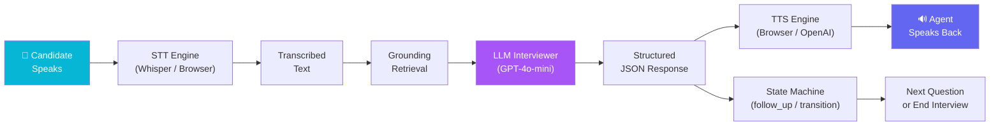
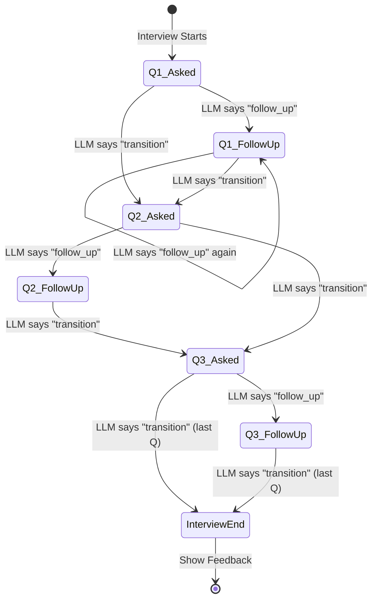
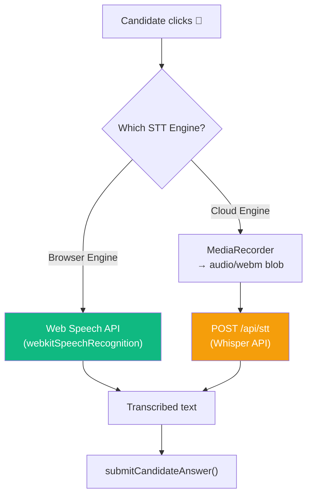
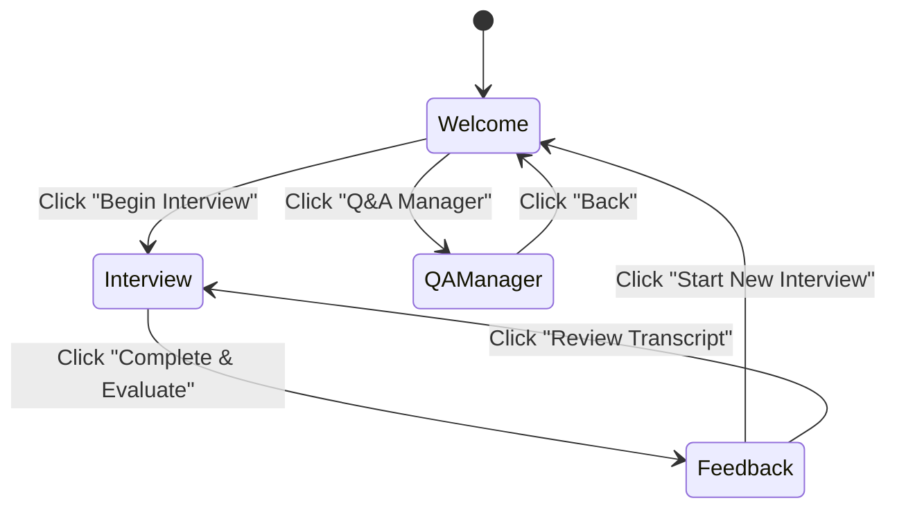
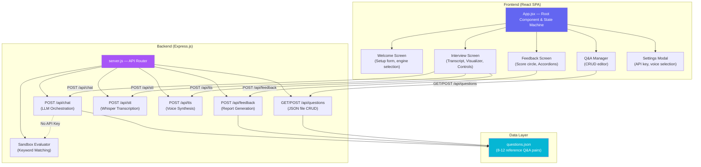
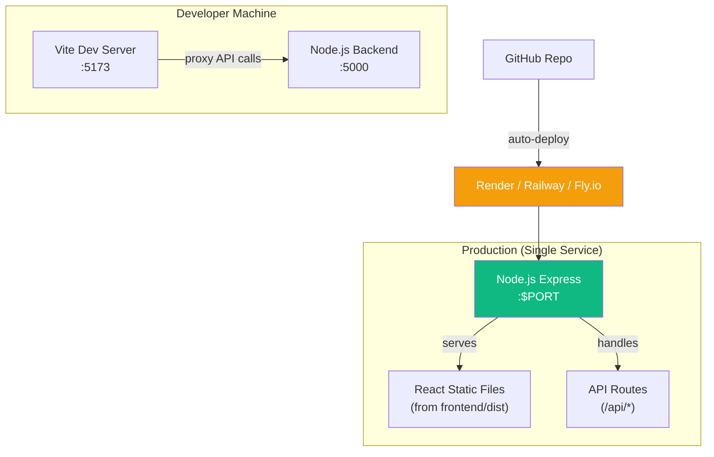

# 🏗️ AegisVoice — Full Architecture Blueprint

> How to build a Voice Interview Agent Grounded in a Reference Q&A Set, from scratch.

---

## 1. The Core Problem

You need to build an agent that:
- **Listens** to a candidate speaking (Speech-to-Text)
- **Knows** the right answer (Grounding from a reference database)
- **Responds** like a real interviewer — not a quiz bot (LLM Orchestration)
- **Speaks** its reply back (Text-to-Speech)
- **Judges** at the end with a structured report (Feedback Generation)

The critical constraint: the agent must **stay grounded** in a fixed set of Q&A pairs. It cannot hallucinate random questions or invent evaluation criteria. The reference set is the source of truth.

---

## 2. High-Level Data Flow

This is the journey of a single interview turn:



Each box is a **separate engineering decision**. Let's walk through them.

---

## 3. Data Layer — The Reference Q&A Store

### What to store
A flat JSON array of 8–12 objects. Each object has:
```json
{
  "id": "q1",
  "topic": "React State Management",
  "question": "Explain the difference between Context API and Redux...",
  "idealAnswer": "A strong answer should highlight: 1. Context is a DI tool... 2. Redux has a centralized store..."
}
```

### Why JSON and not a database?
| Option | Pros | Cons |
|--------|------|------|
| **JSON file** | Zero setup, human-readable, easy to version control, trivially editable | No query engine, no concurrency locks |
| **SQLite** | Structured queries, ACID | Overkill for 10 records, harder to edit by hand |
| **PostgreSQL** | Production-grade | Requires a running database service, connection pooling |
| **Vector DB (Pinecone/Chroma)** | Semantic search | Massive complexity for 10 questions — like using a cannon to kill a fly |

> **Decision**: Use a JSON file (`backend/data/questions.json`). For 8–12 questions, file I/O is instant. It can be edited by hand, committed to Git, or updated via a REST API. No external services needed.

### CRUD API
Expose two endpoints:
- `GET /api/questions` → Read all questions
- `POST /api/questions` → Overwrite the entire array (for the in-app editor)

The server reads/writes using `fs.readFileSync` / `fs.writeFileSync`. For 10 records, this is atomic enough.

---

## 4. Grounding Strategy — How to Match the Right Reference

This is the most important architectural decision. When a candidate answers, **how does the agent know which reference Q&A to evaluate against?**

### Option A: Semantic Similarity Search (Embeddings)
- Embed each reference question using `text-embedding-ada-002`
- When a candidate speaks, embed their answer and find the closest reference via cosine similarity
- **Problem**: The candidate's *answer* about Redux might be semantically closer to a *question* about state management patterns. You'd get false matches. Also adds latency (~200ms per embedding call) and an API cost.

### Option B: Sequential State Machine ✅ (Chosen)
- The interview is a **linear sequence**. Question 1 → Question 2 → Question 3 → ... → End.
- Maintain a `currentQuestionIndex` counter on the client.
- When the LLM evaluates an answer, it always receives `questions[currentQuestionIndex]` as the grounding context.
- When the LLM decides to `"transition"`, the client increments the counter.

> **Why this is better**: In a real interview, the interviewer controls the flow. They don't randomly jump between topics. A sequential state machine preserves this narrative structure, eliminates retrieval errors, and adds zero latency.



### The Hybrid Opportunity (if you had 100+ questions)
If the reference set grew to 50–100+ questions, you'd switch to **semantic retrieval**:
1. Pre-embed all reference questions at startup
2. When the LLM decides to `"transition"`, embed the candidate's conversation context and retrieve the top-3 most relevant *unasked* questions
3. Let the LLM pick which one flows most naturally

But for 10 questions? Sequential is perfect.

---

## 5. LLM Orchestration — Making it Behave Like a Real Interviewer

### The System Prompt Architecture

The LLM receives a **system prompt** containing:
1. **Role definition**: "You are a professional, friendly technical interviewer"
2. **Voice constraint**: "Your replies must be 2–4 sentences, conversational, no markdown"
3. **Grounding injection**: The current question + ideal answer are injected directly into the prompt
4. **Decision framework**: Clear instructions for when to `follow_up` vs `transition`
5. **Output schema**: Force JSON output with three fields

### Why JSON Mode is Critical

Instead of letting the LLM return freeform text, we force structured JSON:

```json
{
  "reply": "That's a great start! You mentioned Redux has a centralized store, which is correct. Could you elaborate on how Context API differs in terms of re-rendering behavior?",
  "evaluation": "Candidate correctly identified Redux's store pattern but missed Context's re-render limitation and the performance trade-off.",
  "decision": "follow_up"
}
```

**Why three separate fields?**

| Field | Purpose | Consumer |
|-------|---------|----------|
| `reply` | What the interviewer says out loud | → TTS Engine → Speaker |
| `evaluation` | Internal grading notes (never spoken) | → Grounding Logs panel in UI |
| `decision` | State machine control signal | → Client-side state machine (increment index or stay) |

This separation is the key insight: **the LLM's spoken output and its internal reasoning are decoupled**. The `evaluation` field lets you audit what the LLM thinks without leaking it to the candidate. The `decision` field lets the client control navigation without parsing natural language.

### Guardrails: Preventing Answer Leakage

The system prompt explicitly instructs:
- "Do NOT read the ideal answer to the candidate verbatim"
- "If they are completely stuck, briefly explain the concept yourself, then transition"
- "Ask follow-ups that nudge toward the answer without giving it away"

This keeps the LLM in "interviewer mode" rather than "tutor mode."

---

## 6. Speech-to-Text (STT) Pipeline

### Two Engines, One Interface



| Feature | Browser (Web Speech API) | Cloud (Whisper) |
|---------|--------------------------|-----------------|
| **Cost** | Free | ~$0.006/minute |
| **Latency** | Real-time streaming | 1–3 sec round-trip |
| **Accuracy** | Good for clear English | Excellent, multilingual |
| **Privacy** | Audio stays on device* | Audio sent to OpenAI |
| **Offline** | Yes (on some browsers) | No |

> *Chrome's Web Speech API may route audio through Google servers internally.

### Implementation Detail: MediaRecorder
For the Whisper path, use the browser's `MediaRecorder` API:
1. `getUserMedia({ audio: true })` → get mic stream
2. `new MediaRecorder(stream, { mimeType: 'audio/webm' })` → start recording chunks
3. On stop → `new Blob(chunks, { type: 'audio/webm' })` → POST to `/api/stt`
4. Server uses `openai.audio.transcriptions.create()` with the blob

---

## 7. Text-to-Speech (TTS) Pipeline

### Two Engines, Same Pattern

| Feature | Browser (SpeechSynthesis) | Cloud (OpenAI TTS-1) |
|---------|---------------------------|----------------------|
| **Cost** | Free | ~$0.015 per 1K chars |
| **Voice Quality** | Robotic, varies by OS | Natural, 6 voice options |
| **Latency** | Instant (< 50ms) | 500ms–2s (network + generation) |
| **Reliability** | Chromium has GC bugs | Consistent |

### The Chromium SpeechSynthesis Bug
Chrome's garbage collector destroys `SpeechSynthesisUtterance` objects before they finish playing. **Fix**: Store a persistent ref (`useRef`) to the utterance object to prevent GC.

```
activeUtteranceRef.current = utterance;  // prevents garbage collection
```

Also add a `100ms` delay between `cancel()` and `speak()` to let Chrome's audio stack flush.

---

## 8. Frontend State Machine

The entire UI is driven by a single `currentScreen` state variable:



### Within the Interview Screen
The interview panel itself has a nested status state machine:

```
Idle → (click mic) → Listening → (click mic again) → Thinking → (API returns) → Speaking → (speech ends) → Idle
```

Each status controls:
- Which avatar animation plays (pulse ring, wave visualizer, typing dots)
- Whether the mic button is enabled/disabled
- What the status badge text reads

---

## 9. Feedback Generation

### With API Key (GPT-4o)
Send the full conversation transcript + reference Q&A to `gpt-4o` (stronger model for nuanced evaluation):

```
System: "You are a principal engineer. Review this transcript against these reference answers.
         Return JSON: { overallScore, summary, strengths[], improvements[], questionBreakdown[] }"
```

### Without API Key (Sandbox Mode)
Run a local keyword-overlap algorithm:
1. For each question, extract **domain keywords** from the topic (e.g., "redux", "context", "re-render", "store" for React State Management)
2. Count how many keywords appear in the candidate's answer
3. Score = `base(40) + matches × 15`, capped at 100
4. Generate a report locally without any API call

This gives a rough but instant evaluation that's useful for practicing.

---

## 10. Component Architecture



---

## 11. Latency Analysis — Where Time Is Spent

In a single interview turn (candidate speaks → agent replies), here's the latency breakdown:

| Stage | Browser Engine | Cloud Engine | Optimization |
|-------|---------------|--------------|-------------- |
| **STT** | ~0ms (real-time) | 1–3s (Whisper API) | Use browser STT for instant results |
| **Grounding Retrieval** | ~0ms (array index lookup) | ~0ms | Sequential index = O(1) |
| **LLM Evaluation** | N/A (Sandbox: ~5ms) | 1–3s (GPT-4o-mini) | Use `gpt-4o-mini` (not `gpt-4o`), limit context to last 6 messages |
| **TTS** | ~50ms (browser) | 500ms–2s (OpenAI TTS) | Use browser TTS for zero-latency |
| **Total** | **~50ms** | **3–8s** | |

### Key Optimization Decisions:
1. **Model choice**: `gpt-4o-mini` for chat (fast, cheap) vs `gpt-4o` for feedback (accurate, only called once)
2. **Context window trimming**: Only send the last 6 messages to the LLM, not the entire transcript
3. **Sequential grounding**: O(1) array lookup vs O(N) embedding search
4. **Browser-first defaults**: STT and TTS default to browser engines for zero-cost, zero-latency testing

---

## 12. Production Deployment Architecture



### Why a Unified Single Service?
- **Cost**: One container instead of two = half the hosting cost
- **Simplicity**: No CORS configuration needed in production
- **Deployment**: Single build command, single start command
- The Express server serves `frontend/dist` as static files and handles `/api/*` routes — everything runs on one port

---

## 13. Build Order — If Starting From Scratch

If you were building this from day zero, here's the sequence:

### Phase 1: Data Foundation (30 min)
1. Create `backend/data/questions.json` with 10 reference Q&A pairs
2. Build the Express server with `GET /POST /api/questions` endpoints
3. Test with `curl` or Postman

### Phase 2: LLM Chat Loop (1 hour)
4. Build `POST /api/chat` — inject the grounding context into a system prompt, call `gpt-4o-mini`, return structured JSON
5. Test with Postman: send a fake message array, verify the LLM returns `reply`, `evaluation`, `decision`

### Phase 3: STT + TTS Endpoints (30 min)
6. Build `POST /api/stt` (Multer file upload → Whisper)
7. Build `POST /api/tts` (text → OpenAI TTS → binary stream)

### Phase 4: React Frontend Shell (1.5 hours)
8. Scaffold with Vite (`npx create-vite`)
9. Build the Welcome Screen with setup form
10. Build the Interview Screen with transcript, mic button, and text fallback
11. Wire up `fetch()` calls to the backend

### Phase 5: Browser Engines (45 min)
12. Add `webkitSpeechRecognition` for free STT
13. Add `SpeechSynthesisUtterance` for free TTS
14. Add engine toggle switches in Settings

### Phase 6: Feedback + Polish (1 hour)
15. Build `POST /api/feedback` endpoint
16. Build the Feedback Dashboard UI (score circle, accordions)
17. Add the Q&A Manager CRUD screen
18. Add Canvas audio visualizer
19. Apply glassmorphism styling

### Phase 7: Sandbox Mode (30 min)
20. Add keyword-matching evaluator as fallback when no API key exists
21. Generate local feedback reports without any external API calls

### Phase 8: Deploy (15 min)
22. Create root `package.json` to coordinate builds
23. Update Express to serve `frontend/dist` statically
24. Push to GitHub, deploy on Render/Railway

---

## 14. Summary of Key Engineering Decisions

| Decision | Choice | Rationale |
|----------|--------|-----------|
| Data store | JSON file | 10 records, no DB needed, human-editable |
| Retrieval | Sequential index | O(1), preserves interview narrative, zero latency |
| LLM model | gpt-4o-mini (chat), gpt-4o (feedback) | Speed vs accuracy trade-off |
| Output format | Structured JSON mode | Decouples speech from evaluation from navigation |
| Default engines | Browser Web Speech API | Free, instant, no API key required |
| Guardrails | System prompt instructions | Prevents answer leakage, enforces interviewer behavior |
| Deployment | Single Express service | Serves both API and static files on one port |
| Fallback mode | Keyword-overlap sandbox | Full functionality without any paid API |
